Danny Garber

Commercial Software Engineering,

Microsoft

**Reviewers**

Mike Hopcroft, Michael Lanzetta, Vlad Kolesnikov, Ian Philpot, Swetha
Sundar, Max Zilberman (Microsoft)

March 5, 2019

**ABSTRACT**

Nowadays with million travelers every day passing through thousands of
airports worldwide, transferred via many connected flights en route, the
baggage handling operations became as one of the crucial activities
every airport is involved daily. The main role of baggage handling
operations is to sort and transport all transfer and check-in bags to
each destination based on the time window. The airport, which has the
authority to handle bags thru the airport system should ensure there is
no "lost" bag in the system. By lost bag, it means a bag that did not
arrive in time for assigned flight. There are many researches trying to
solve the problem of "lost" bags at the airport. (Abdelghany A, 2016)
Many researches try to optimize the bag route in baggage handling
system. This will help in minimizing the overall costs directly
correlated to the total amount of miss-connected bags. In computer
science, the routing is based on the shortest path problem. This paper's
main objective is to evaluate whether Floyd-Warshall Algorithm in
solving the shortest path problem in the minimum of time has sufficient
real-world performance to solve this challenge.

An evaluation was performed on a variety of hardware and software
optimizations, which included CPU linear optimization and 4 different
Graphics Processing Unit (GPU) memory optimizations using Compute
Unified Device Architecture (CUDA): linear, coalesced, shared and
blocked optimizations.

A software framework with a source code for finding optimal solution to
the shortest path problem is presented. This research answers the
following questions:

-   How many loosely connected vertices can be computed in under 2
    seconds of runtime?

-   Which hardware and software optimization technique achieves the
    fastest performance of Floyd-Warshall algorithm, and can this
    algorithm be used to solve the all-pairs shortest path problem for
    at minimum of 500 vertices with time bound of 2 seconds?

The results we obtained when answering this question show how effective
each optimization is at performing its task, and suggest what
optimization is the most optimal when performing Floyd-Warshall
algorithm.

***Keywords***: Floyd Warshall algorithm, all pair shortest path
algorithm, CUDA, linear optimization, coalesced memory optimization,
shared memory optimization, blocked memory optimization, comparison of
memory optimizations.

INTRODUCTION
============

The mishandling of baggage in airports has been one of the more
important issues for passengers worldwide for several years. Baggage
which is checked in will travel through the baggage system to baggage
sorting stations, handlers at the sorting stations will sort and load
the baggage onto baggage carts (tugs) and take them straight to the gate
to be loaded into the aircraft.

Baggage handling operations is a complex system because many factors are
involved such as quantity of the bags, interval of arrivals, connecting
flights and barcode misreads. (Dina Hafilah, December 2017).
Furthermore, baggage often needs to be transferred into a connected
flight with a short connection time, so the bags are needed to be taken
directly to a connected flight gate without being transferred to a
sorting station in between the flights (Tail-to-Tail).

One of the major handicaps about airports with high ground traffic load,
is that baggage misconnection may occur more often when baggage
handler's assignment tasks are not performed in the most optimal way
possible. The rate of misconnected bags is a NHSB reported metric for
all airlines is Misconnected Bag Rate or MBR.

*We theorize* *that a computer supported decision system which can
continuously suggest the most optimal way to complete "transfer" tasks
will play a significant role in reducing the MBR.*

Optimization of ground movements of baggage handlers by means of
advanced algorithms is taken into consideration in this study. The study
aims to validate viability of the Operations Research, NP-Hard algorithm
in solving this problem.

There are a few algorithms classes that can be considered to tackle this
problem:

-   All Pairs Shortest Path - Floyd-Warshall, Johnson's

-   Search - Dijkstra\'s, LNS

-   Traveling Salesman Problem - VRP, VRPPD, VRPTW

This paper will concentrate on Floyd-Warshall performance. In order to
implement the system under consideration, Floyd-Warshall all pairs
shortest path algorithm has been evaluated using different types of
hardware and software optimizations.

LITERATURE REVIEW
=================

Being a classical problem, the shortest path problem has been
investigated through various approaches. Generally, in order to
represent the shortest path problem, we use graphs. A graph is a
mathematical abstract object, which contains sets of vertices and edges.
Edges connect pairs of vertices. Along the edges of a graph it is
possible to walk by moving from one vertex to other vertices. Depending
on whether one can walk along the edges by both sides or by only one
side determines if the graph is a directed graph or an undirected graph.
In addition, lengths of edges are often called weights, and the weights
are normally used for calculating the shortest path from one point to
another point. The weights may be cost travelled along a road or time
taken to travel that road, according to the situation. In the real world
it is possible to apply the graph theory to different types of
scenarios.

For example, in the airport baggage handling optimization scenario a
graph represents the map of baggage handling operations, where vertices
represent, tug locations, gates and sorting stations and edges represent
routes that connect these points-based time or effort it takes to
traverse. There exist different types of algorithms that solve the
shortest path problem. This paper concentrates on the all pairs shortest
path (APSP) problem, since the airport baggage handling model needs to
evaluate the shortest paths for every pair of vertices.

In the next section, we discuss one of the most popular conventional
shortest path algorithms called Floyd-Warshall algorithm. In section 4
we formulate the problem statement for the scenario we apply the all
pairs shortest path problem. In section 5, we explain performance
optimization techniques used in this study. Then we follow with the
short introduction to CUDA in the section 6. The experimental setup and
results are described in section 7 and 8 respectively. In section 9 we
conclude the result.

FLOYD-WARSHALL ALGORITHM
========================

Floyd-Warshall Algorithm is an algorithm based on dynamic programming
technique to compute the shortest path between all pair of nodes in a
graph. The credit of Floyd-Warshall Algorithm goes to Robert Floyd,
Bernard Roy and Stephen Warshall. (Floyd, 1962)

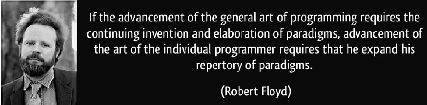

The base of the Floyd-Warshall algorithm stands on a simple formulation.
If a graph consists of X, Y and Z vertices and the shortest distance
between X and Z is depicted as min(distance(X,Z), then this distance is
equal to the sum of the distance between X and Y (distance(X,Y)) and the distance between Y and Z (distance(Y,Z)). The algorithm is the
systematic application of this process for the whole graph.

In order to make the description of the algorithm easier, a simple graph given in the **Fig. 1** is used to show iterations step by step. The algorithm computes two matrices: The $\mathbf{\text{Cost}}$ matrix which includes the distances between each connected vertex-pair, and the $\mathbf{\text{Path}}$ matrix, which includes the sequential
relationship between vertices, i.e. it holds the last vertex before the
terminal one, if it exists, in the shortest path between two vertices.
Since the $\mathbf{\text{Cost}}$ matrix is composed of direct distance
between vertices, the very first cost value between two vertices is
taken as infinity if they are not directly connected. The
$\mathbf{\text{Path}}$ matrix is initialized with the 0 value for
diagonal vertices and with the value of the vertex if the shortest path
exists between any two vertices, otherwise the value of -1 is assigned
to the corresponding matrix position.

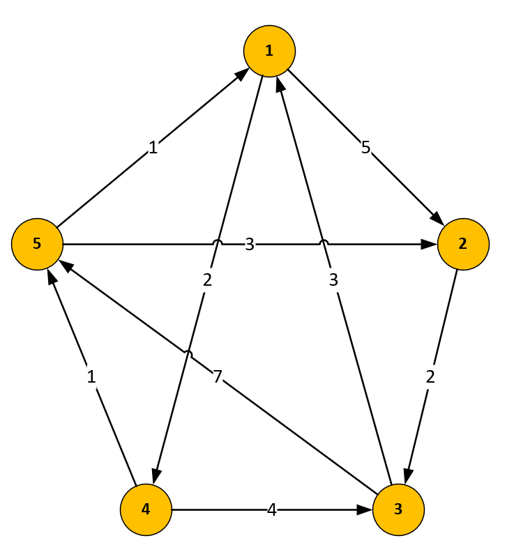

*Figure 1*. An algorithm demonstration

 h<sub>&theta;</sub>(x) = &theta;<sub>o</sub> x + &theta;<sub>1</sub>x
The given pseudo-code of the algorithm simply means that, if the sum of
new distances between $v$ and $\mathbf{u}$ vertices when the $\mathbf{k}$ vertex is placed between them is smaller than the older distance, then the $\mathbf{k}$ vertex must be placed in the corresponding index in the $\mathbf{\text{Path}}$ matrix and the corresponding distance value in the $\mathbf{\text{Cost}}$ matrix must be updated with the new value.


The initial case of the $\mathbf{\text{Cost}}$ and
$\mathbf{\text{Path}}$ matrices ($\mathbf{\text{Cost}_0}$ and
$\mathbf{\text{Path}_0}$) are shown in the **Table 1:**

 | $\mathbf{\text{Cost}_0}$ | **1** | **2** | **3** | **4** | **5** | $\mathbf{\text{Path}_0}$ | **1** | **2** | **3** | **4** | **5** |
-|--------------------------|-------|-------|-------|-------|-------|--------------------------|-------|-------|-------|-------|-------|
 |
 | **1** | | 0 | | 5 | | ∞ | | 2 | | ∞ | | **1** | | 0 | | 1 | | -1 | | 1 | | -1 | |
 | **2** | | ∞ | | 0 | | 2 | | ∞ | | ∞ | | **2** | | -1 | | 0 | | 2 | | -1 | | -1 | |
 | **3** | | 3 | | ∞ | | 0 | | ∞ | | 7 | | **3** | | 3 | | -1 | | 0 | | -1 | | 3 | |
 | **4** | | ∞ | | ∞ | | 4 | | 0 | | 1 | | **4** | | -1 | | -1 | | 4 | | 0 | | 4 | |
 | **5** | | 1 | | 3 | | ∞ | | ∞ | | 0 | | **5** | | 5 | | 5 | | -1 | | -1 | | 0 | |

*Table 1*. $\mathbf{\text{Cost}_0}$ and $\mathbf{\text{Path}_0}$ matrices

The algorithm then iterates and generates
$\mathbf{\text{Cost}_1}$ and $\mathbf{\text{Path}_1}$
matrices (given in the **Fig. 2**) from $\mathbf{\text{Cost}_0}$
and $\mathbf{\text{Path}_0}$ matrices,
$\mathbf{\text{Cost}_2}$ and $\mathbf{\text{Path}_2}$ matrices
from $\mathbf{\text{Cost}_1}$ and $\mathbf{\text{Path}_1}$
matrices, and eventually $\mathbf{\text{Cost}_{n-1}}$ and
$\mathbf{\text{Path}_{n-1}}$ matrices from $\mathbf{\text{Cost}_{n-2}}$ and $\mathbf{\text{Path}_{n-2}}$ matrices.

Basically, the procedure operates as follows: If there is an edge
between vertices $\mathbf{v}$ and $\mathbf{u}$, then the matrix
$\mathbf{\text{Cost}_0}$ contains its length at the corresponding
coordinates. The diagonal of the matrix contains only zeros. If there is
no edge between vertices $\mathbf{v}$ and $\mathbf{u}$, then the
position $\left( \mathbf{v,u} \right)$ contains positive infinity. In
each iteration of Floyd-Warshall algorithm this matrix is recalculated,
so it contains lengths of paths among all pairs of vertices using
gradually enlarging set of intermediate vertices. The matrix
$\mathbf{\text{Cost}_1}$, which is created by the first iteration
of the procedure, contains path costs among all vertices using exactly
one (predefined) intermediate node. $\mathbf{\text{Cost}_2}$
contains lengths using two predefined intermediate vertices. Finally,
the matrix $\mathbf{\text{Cost}_n}$ uses $\mathbf{n}$
intermediate vertices.


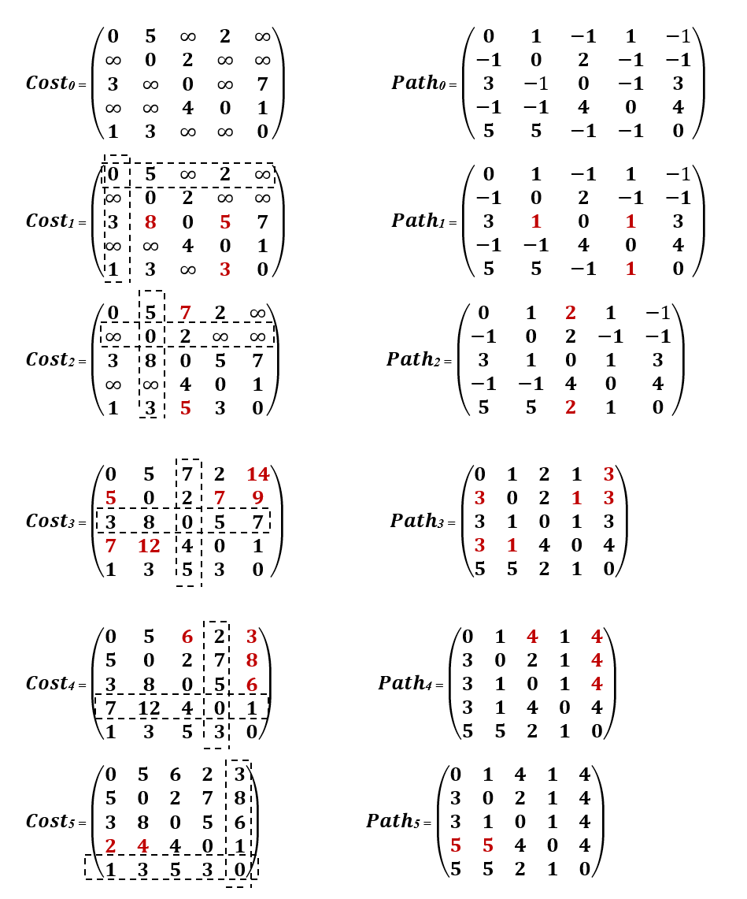

*Figure 2*. Cost and Path matrices transformation

This transformation can be described using the following recurrent
formula:

$$C_{\text{vu}}^{n} = \min\left( C_{\text{vu}}^{n - 1},C_{\text{vk}}^{n - 1} + C_{\text{ku}}^{n - 1} \right)$$

The iteration number $\mathbf{k}$ is also the index of the matrices
($\mathbf{\text{Cost}_k}$ and $\mathbf{\text{Path}_k}$) generated at the end of the iteration. In each iteration, the new values of $\mathbf{\text{Cost}_k}$ is obtained updating the $\mathbf{\text{Cost}_k}$ with respect to the vertex $\left( \mathbf{v,u} \right)$ in the index $\mathbf{k}$. For instance, at the first iteration $\mathbf{(k\  = \ 1)}$, values in the first row and the first column of $\mathbf{\text{Cost}_0}$ matrix in the **Fig. 2** are used to update the other values in the matrix, respectively:
$C\left( 3,1 \right) + C\left( 1,2 \right) \Rightarrow 5 + 3 = 8$

Correspondingly, the $\mathbf{\text{Path}}$ matrix can be read as
follows: if we want to reconstruct the (shortest) path between vertices
$\mathbf{v}$ and $\mathbf{u}$, then we look at the element at
corresponding coordinates. If its value is $\mathbf{- 1}$, then there is no path between these vertices, otherwise the value of the element
denotes predecessor of $\mathbf{u}$ on the path from $\mathbf{v}$ to
$\mathbf{u}$. So, we repeat this procedure, while the preceding vertex
is not equal to $\mathbf{v}$.

$$P_{vu} = \begin{Bmatrix}
0 \begin{matrix} \ \ \ \ if\ v = u\ or \ C_{vu} = \ \infty
\end{matrix}\\  
i \begin{matrix} \ \ \ \ in\ all\ other\ cases\ \ \ \ \ \  
\end{matrix}  
\end{Bmatrix}
$$

$$P^{(n)}_{vu} = \begin{Bmatrix}
P^{(n-1)}_{vu} \begin{matrix} \ \ \ \ if\ C^{(n-1)}_{vu} \leq \ C^{(n-1)}_{vk} \ + \ C^{(n-1)}_{ku}
\end{matrix}\\  
P^{(n-1)}_{ku} \begin{matrix} \ \ \ \ if\ C^{(n-1)}_{vu} > \ C^{(n-1)}_{vk} \ + \ C^{(n-1)}_{ku}
\end{matrix}\\  
\end{Bmatrix}
$$

The pseudo-code of the Floyd-Warshall algorithm is shown in the **Fig.
3**. The indices $\mathbf{k}$ stands for the current iteration number,
$\mathbf{v}$ stand for the row number of the matrices and $\mathbf{u}$
stands for the column number of the matrices. The algorithm iterates one
minus the number of vertices and updates the matrices in each iteration.
At the end of all the iterations, there exist two matrices keeping the
shortest distances and cost information about all the vertices.

```c#
loop v from 1 to n
  loop u from 1 to n
    if v = u then
      path\[v,u\] = 0
    else if there exists an edge from v to u then
      cost\[v,u\] = graph\[v,u\]
      path\[v,u\] = v
    else
      cost\[v,u\] = infinity
      path\[v,u\] = -1
    end if
  end loop
end loop

loop k from 1 to n
  loop v from 1 to n
    loop u from 1 to n
      if cost\[v,k\] + cost \[k,u\] \< cost\[v,u\] then
        cost\[v,u\] = cost\[v,k\] + cost \[k,u\]
        path\[v,u\] = path\[k,u\]
      end if
    end loop
  end loop
end loop
```

*Figure 3*. Floyd-Warshall Algorithm

The time complexity of the algorithm is determined by the triple nested
for loops that clearly show that the running time of this algorithm is
$\mathbf{\Theta(n}\mathbf{3}\mathbf{)}$. The distance matrix containing
$\mathbf{Cost\lbrack v,u\rbrack}$ values provides the distance of
shortest path from $\mathbf{v}$ to $\mathbf{u}$ and the route of the
shortest paths can be easily constructed from the predecessor matrix
containing $\mathbf{Path\lbrack v,\ u\rbrack}$ values.

PROBLEM STATEMENT
=================

In the baggage handling problem, the cost in edges is the ratio of
Number of Bags" and travel time between segments. Vertices are the
actual location of {gates, evaluated tugs, drop off locations}.
Therefore, the problem can be generalized into a classical version that
fits well with the algorithm.

Let's take a previous sample graph and slightly modify it by adding the
bags icons representing the number of bags available for pickup or
drop-off at each node, which now represent the actual airport gates, as
shown in Figure 4. Additionally, the edge weights are now showing a
travel time to get from one gate to another.


*Figure 4*. A sample graph with edge labels represent the costs

Furthermore, since the number of bags waiting for us at each gate can
change dynamically, we assume that we have a graph with dynamic edge
costs. That means that we must be able to figure out efficiently the
shortest path, which is a function of number of bags and travel time
from any particular gate to any other gate, if such path is available
and achievable in the allocated time interval (e.g. between the flight
arrivals).

$$\mathbf{\text{Path}_{vu}}{= f(bags_v}{\ \pm \ bags_u}{,\ time_{u,v}}{)\ }$$

Our goal is to reduce the query time, where we expected the pairs of
source gate and target gate to be uniformly picked.

A sample query could be: \
**Can a baggage handler reach A5 from A1?** \
The answer, obviously, is yes. However, the more specific query would be: \
**What would be the most efficient route (or the higher reward) to go
from the gate A1 to gate A5?** \
By analyzing the graph depicted in Fig. 4, we could reach the conclusion that the highest reward a baggage handler can receive in this case by going **from gate A1** **to A4 and then to A5.** The cost of travel time reaching gate A5 from A1 via gate A4 is 7 (1 + 6 =\> 7). And the cost of travel time reaching gate A5 directly from the gate A1 is 3. However, if we consider the formula of the Path we just presented above, then the Path from gate A1 to A4 and to A7 will render us more bags collected: A1(1) + A4(7) + A5(4) = 12 bags, than if we go straight from gate A1 to A5 (1 + 4 = 5 bags).
Therefore, even if the distance between the gates might be shorter, it
is not guaranteed it will be the most efficient one.

Another query could be: \
**Can A5 reach A2?** \
The answer is no. No path from A5 to A2 exists. This answer will stay *no* forever, regardless any cost changes.

Ultimately, the important question to be answered: \
***For how many vertices the all pairs shortest path can be computed
within the target maximum time?*** \
This study is going to focus on answering this exact question.

PERFORMANCE OPTIMIZATION TECHNIQUES
===================================

In this study we focused on comparing various hardware (CPU vs. GPU) and
software (memory and multi-threading core) optimization techniques.
First, we evaluated the performance of the Floyd-Warshall algorithm
using the linear algorithm computation based on a standard
Floyd-Warshall naïve implementation using CPU cores automatic
multi-threading optimization.

All the remaining optimization tests have been done using CUDA framework
taking advantage of high performance computing model to program against.
However, even with the tools provided by CUDA, making full use of the
inherent processing power of a GPU can be a challenge, since the speed
of computation may not be limited by the speed of the processing units,
but can also be limited by memory bus bandwidth or problems with thread
scheduling.

Implementations of the Floyd-Warshall algorithm for CUDA have been
presented in the past. Harish and Narayanan (Narayanan, 2007) presented
an implementation assigning a single thread for each atomic task. This
execution time of this approach was limited by the time necessary to
pass data over the bus between global memory and the multiprocessors. In
our study we have started with this approach first using both CPU and
CUDA linear optimization.

Then, we have improved our test performance by using 3 different
optimization techniques: memory coalescing, shared memory and blocked
approach -- each one performs several tasks for each data element passed
over the global memory bus. In order to achieve the maximum performance
on GPU, it is desired to maximize the parallel execution. There is a
metric known as *occupancy*, indicating how effectively the GPU
resources are kept busy (NVIDIA Corporation, 2019). Occupancy is the
ratio of the active threads to the maximum possible threads per
streaming multiprocessor. There are three main sources for limiting the
occupancy: 1- registers, 2- shared memory and 3- block size, i.e.
assigned number of threads per block. In our study we tested all three
sources, each with each own technique and constrains.

The following sub-sections describe these optimization techniques in
more details.

GPGPU Optimization
------------------

So called General-Purpose Computing on Graphics Processing Units (GPGPU)
is a method of using the GPU registers to perform computations that
would usually be executed by the CPU, rather than performing
calculations to handle computer graphics, as is their traditional use.
When the GPU is used for GPGPU, it can be viewed as a coprocessor to the
CPU, offloading complex tasks that the GPU can tackle in parallel. CUDA
has an execution model unlike the traditional sequential model used for
programming CPUs. In CUDA, the code is executed by multiple threads at
once (often hundreds or thousands). Therefore, in our study we modeled
our solution in such a way as to take advantage of using multiple
threads by defining a thread hierarchy of CUDA *grid*, *blocks* and
*threads*.

When using the GPGPU optimization for computing Floyd-Warshall
algorithm, we specified the size of the grid to be precisely of the size
of the graph we compute as shown in this code excerpt:

```c
// dimension
dim3 dimGrid(size, size, 1);

// run kernel
for (unsigned int k = 0; k < size; ++k)
   cudaKernel << <dimGrid, 1 >> > (matrixOnGPU, pathOnGPU, size, k);
```

First, we instantiate the kernel by specifying a number of blocks (or
"blocks per grid"), in our case the size of the compute graph, and a
number of threads per block (in GPGPU we used one thread per block).
Then we run the kernel, by passing it the input arrays (the Cost and the
Path matrices). Note that running a kernel is synchronous operation.

When running a kernel, the kernel function's code is executed by every
thread once. It therefore must know which thread it is in, in order to
know which array element(s) it is responsible for. When computing our
algorithm using GPGPU optimization, we determined the position of the
thread in the grid and block using simple compute indexes$^1$

```c
// compute indexes
int v = blockIdx.y;
int u = blockIdx.x;

int i0 = v * size + u;
int i1 = v * size + k;
int i2 = k * size + u;
```

**Note:** ***threadIdx**, **blockIdx**, **blockDim** and **gridDim** are
special objects provided by the CUDA backend for the sole purpose of
knowing the geometry of the thread hierarchy and the position of the
current thread within that geometry.*

Multiple GPUs in a single system can be utilized for a single problem,
often increasing the performance of parallel applications. However, this
study did not utilize multiple GPU cards.

Shared Memory Optimization
--------------------------

Efficient use of on-chip shared memory can help achieve a greater
performance with GPUs in memory-bounded kernels. In computing multi
vertices graphs, row and column values should be loaded repeatedly to
compute the new result entries. Such repeated memory transactions from
the global memory in GPUs are costly due to limited bandwidth and high
latency. One strategy to reduce the global memory bandwidth traffic is
to use the available on-chip memory. In this way, multiplicand entries
can be loaded once onto the on-chip memory to eliminate the need of
global memory transactions for the next access times.

The main constraint in using shared memory is the limited size of the
on-chip memory. Additionally, in using shared memory optimization, the
maximum number of registers which can be assigned per thread is limited.
If a thread exceeds that limit, the excess data is automatically
transferred to the global memory local to that thread. As seen in Table
2, physical constraints vary on GPUs with different compute capabilities
(we only show the constrains for the GPUs have been tested in this study
compared to the reference latest GPU from NVIDIA$^2$):

 | **GPU Card Model** | **Tesla K80** | **1080 Ti** | **RTX 2080 Ti**
-|--------------------|---------------|-------------|----------------
 | 
 | **Compute Capability** | **3.7** | **6.1** | **7.0**
 | **Maximum number of resident grids per device (Concurrent Kernel Execution)** | 32 | 32 | 128
 | **Maximum amount of shared memory per multiprocessor** | 112 KB | 96 KB | 96 KB
 | **Maximum amount of shared memory per thread block** | 48 KB | 48 KB | 96 KB
 | **Maximum dimension of a grid of thread blocks** | 65535 | 65535 | 65535
 | **Maximum threads per multiprocessor** | 2048 | 4096 | 4096

*Table 2*. Physical constraints for different compute capabilities

To make the optimum use of the shared memory optimization when computing
Floyd-Warshall algorithm, we divided the graph size to the multiplier
equal of the square root of the maximum dimension of a grid of the
shared thread blocks, which, as shown in Table 2, Row 4, is:
$\sqrt{65535} = 256$

We then use it to define the dimension of our kernel grid and kernel
block.

```c
#define SH_TILE_WIDTH 256

// dimension
dim3 dimGrid(size, size / SH_TILE_WIDTH, 1);
dim3 dimBlock(1, SH_TILE_WIDTH, 1);
```

Coalesced Memory Optimization
-----------------------------

In addition to efficient usage of shared memory and registers, access to
the global memory should be coalesced for an optimal performance (Hwu,
2010). Memory coalescing is a technique which allows optimal usage of
the global memory bandwidth. That is, when parallel threads running the
same instruction access to consecutive locations in the global memory,
the most favorable access pattern is achieved.

Suppose we have a 3x4 matrix below:

$$\begin{matrix}
0 & 1 & 2 & 3 \\
4 & 5 & 6 & 7 \\
8 & 9 & a & b \\
\end{matrix}$$

When it is written into a computer memory, this matrix is stored in a
linear fashion. Each thread in GPU kernel is assigned to one *n*-length
vector. Threads in CUDA are grouped in an array of blocks and every
thread in GPU has a unique id, which can be defined as:

$indx\  = \ bd\  \times bx + tx$, where *bd* represents block dimension,
*bx* denotes the block index and *tx* is the thread index in each block.
So, our matrix maps to memory ($\text{bd\ } \times bx + tx)$

*0 1 2 3 4 5 6 7 8 9 a b*

*In parallel computing we would like to maximize the number of threads
which can be used to access the memory at once. Suppose we use 4 threads
to access our matrix, and this can be done in either of the two ways:*

$$\begin{matrix}
thread\ 0: & 0 & 1 & 2 \\
thread\ 1: & 3 & 4 & 5 \\
thread\ 2: & 6 & 7 & 8 \\
thread\ 3: & 9 & a & b \\
\end{matrix}$$

Or

$$\begin{matrix}
thread\ 0: & 0 & 4 & 8 \\
thread\ 1: & 1 & 5 & 9 \\
thread\ 2: & 2 & 6 & a \\
thread\ 3: & 3 & 7 & b \\
\end{matrix}$$

Which is better? Which will result in coalesced reads, and which will
not?

Either way, each thread makes three memory IOs. Let's look at the first
access and see if the threads access memory consecutively. The first
option's first read accesses 0, 3, 6, 9. Not consecutive, and thus not
coalesced. In this case where memory access is not consecutive, zeroing
the gap between these addresses coalesces the memory access. Since the
allowed size of residing threads per GPU block is limited, the coalesced
data arrangement can be done by storing the first elements of the first
*bd* vectors in consecutive order, followed by first elements of the
second *bd* vectors and so on. The rest of vectors elements are stored
in a similar fashion, as shown in the second option. The second option's
first read accesses 0, 1, 2, 3. That is consecutive, and thus the
fastest read! And it is coalesced! This data rearrangement can lead to a
significant higher memory bandwidth of GPU global memory, as it was
shown in our study performance measurements.

To achieve the coalesced memory optimization, we defined the CUDA kernel
grid of the size proportional to the size of the graph divided by 32
bytes (defined in COA\_TILE\_WIDTH constant), which equal to the maximum
number of resident grids per device as per Table 2 specifications.

```c
#define COA_TILE_WIDTH 32
// dimension
dim3 dimGrid(size / COA_TILE_WIDTH, size / COA_TILE_WIDTH, 1);
dim3 dimBlock(COA_TILE_WIDTH, COA_TILE_WIDTH, 1);

// run kernel
for (unsigned int k = 0; k < size; ++k)
  cudaKernel_coa <<< dimGrid, dimBlock >>> (matrixOnGPU, pathOnGPU, size, k);
```

Then, when running the kernel, we calculated the matrix indexes using
the formula for coalesced memory optimization:

```c
// compute indexes
int v = blockDim.y * blockIdx.y + threadIdx.y;
int u = blockDim.x * blockIdx.x + threadIdx.x;
```

Blocked Memory Optimization
---------------------------

The Blocked Algorithm by Venkataraman et al. (Gayathri Venkataraman, 2003) was designed, and optimized, with CPU cache in mind, rather than
optimizing for RAM, which was the standard at the time. In utilizing
cache, Venkataraman could achieve a substantial speed-up over the
standard Floyd-Warshall algorithm in solving the APSP problem. The
algorithm begins by partitioning the adjacency matrix into sub matrices
of size $\text{stages\ x\ stages}$ where $\text{stages}$ is known as the
blocking factor.

```c
// loads data from global memory to shared memory
__shared__ int subMatrix[BLCK_TILE_WIDTH][BLCK_TILE_WIDTH];
subMatrix[v][u] = matrix[index];
__shared__ int subPath[BLCK_TILE_WIDTH][BLCK_TILE_WIDTH];
subPath[v][u] = path[index];
```

Usually, it is normal for $\text{stages}$ to divide wholly into $|V|$,
where V is the size of graph's vertices. In our study we used the Block
Tile Width of 32 as the division factor.

```c
#define BLCK_TILE_WIDTH 32
```

The algorithm performs $\text{stages}$ iterations of line one in Floyd
Warshall algorithm on each $\text{stages\ x\ stages}$ block of
BLCK\_TILE\_WIDTH before it proceeds to the next $\text{stages}$
iterations.

```c
// dimensions
dim3 blockSize(BLCK_TILE_WIDTH, BLCK_TILE_WIDTH, 1);
dim3 phase1Grid(1, 1, 1);
dim3 phase2Grid(stages, 2, 1);
dim3 phase3Grid(stages, stages, 1);

// run kernel
for (int k = 0; k < stages; ++k)
{
  int base = BLCK_TILE_WIDTH * k;
  phase1 << < phase1Grid, blockSize >> > (matrixOnGPU, pathOnGPU, size, base);
  phase2 << < phase2Grid, blockSize >> > (matrixOnGPU, pathOnGPU, size, k, base);
  phase3 << < phase3Grid, blockSize >> > (matrixOnGPU, pathOnGPU, size, k, base);
}
```

To increase understanding of the algorithm, Venkataraman et al.
(Gayathri Venkataraman, 2003) suggest thinking of each set of
$\text{stages}$ iterations as being split into three separate phases. In
phase 1 of the first iteration, Floyd-Warshall algorithm is used to
compute the elements within the sub matrix located at (0; 0). As this
set of iterations only accesses the elements within this block,
Venkataraman et al. state that the sub matrix is called the
self-dependent block. In the above code snippet we say that k is
$1\  \leq k\  \leq stages$.

In phase 2, a modified version of Floyd-Warshall Algorithm is used to
compute the remaining sub matrices that are on the same row and column
as the self-dependent block.

```c
// calculate shortest path
for (int k = 0; k < BLCK_TILE_WIDTH; ++k)
{
  // read in dependent values
  const int i0_value = ownMatrix[threadIdx.y][threadIdx.x];
  const int i1_value = ownMatrix[threadIdx.y][k];
  const int i2_value = primaryMatrix[k][threadIdx.x];

  if (i1_value != INF && i2_value != INF)
  {
    const int sum = i1_value + i2_value;
    if (i0_value == INF || sum < i0_value)
    {
      ownMatrix[threadIdx.y][threadIdx.x] = sum;
      ownPath[threadIdx.y][threadIdx.x] = primaryPath[k][threadIdx.x];
    }
  }
}
```

Finally, in phase 3, the remaining sub matrices are computed. Like phase
2, this computation is completed using a modified version of
Floyd-Warshall Algorithm:

```c
for (int k = 0; k < BLCK_TILE_WIDTH; ++k)
{
  // read in dependent values
  const int i0_value = v_u;
  const int i1_value = colMatrix[threadIdx.y][k];
  const int i2_value = rowMatrix[k][threadIdx.x];

  if (i1_value != INF && i2_value != INF)
  {
    const int sum = i1_value + i2_value;
    if (i0_value == INF || sum < i0_value)
    {
      v_u = sum;
      i_j = rowPath[k][threadIdx.x];
    }
  }
}
```

The process then repeats until $\text{stages}$ iterations of the
algorithm have been performed. We are left with an algorithm that solves
the APSP problem with the intention of improving running times when
compared to the standard Floyd-Warshall algorithm.

WHAT IS CUDA?
=============

CUDA is a parallel computing solution developed by NVIDIA, encompassing
both a software and hardware architecture for using an NVIDIA GPU as a
parallel computing device without the need for a graphics API. The CUDA
API is an extension of the C programming language, providing programmers
with a set of tools to create parallel algorithms. (NVIDIA Corporation,
2019)

By providing the API in C, CUDA gives many programmers who already know
C to quickly pick up their tools and begin creating CUDA applications.
As a parallel computing platform, CUDA is designed to run thousands of
threads at the same time, each thread executing the same code, but
acting on multiple pieces of data, usually chosen programmatically to
ensure that each thread works on different pieces of unique data. Using
this method, applications can be executed on the GPU, rather than the
CPU as described above.

EXPERIMENTAL SETUP
==================

The experiments have been conducted in two environments:

-   Local -- on a desktop with Intel Core i9-9960 16-core CPU (no CPU or
    RAM overclocking was used), @ 3.1 GHz, CORSAIR Vengeance LPX 64GB
    DDR4 SDRAM DDR4 4200 RAM, NVIDIA GeForce 1080 Ti 11GB GPU card,
    Samsung 970 PRO Series 1TB PCIe NVMe M.2 SSD on Windows 10
    Enterprise operating system.

-   Azure Cloud -- on Azure VM with Standard NC6 (6 vcpus, 56 GB RAM,
    NVIDIA Tesla K80) configuration and SSD hard disk running Windows
    Server 2016

The program was written in C++ and compiled by nvcc NVIDIA CUDA compiler
and Visual C++ (v141) compiler.

The graphs for the experiments are weighted and directed and have been
generated randomly using the graph density factor (from 0 to 100).

```c
//density will be between 0 and 100, indication the % of number of directed edges in graph
void GenerateRandomGraph(int* graph, int vertices, int density, int range) {
  //range will be the range of edge weighting of directed edges
  const int prange = (100 / density);
  for (auto v = 0; v < vertices; v++) {
    for (auto e = 0; e < vertices; e++) {
      if (v == e) {//set graph[i][i]=0
        graph[v * vertices + e] = 0;
        continue;
      }
      auto pr = rand() % prange;
      //set edge random edge weight to random value, or to INF
      graph[v * vertices + e] = pr == 0 ? ((rand() % range) + 1) : INF;
    }
  }
}
```

This function generates random graphs of $n$ vertices where each
possible edge can exist with probability $\text{pr}$. The number of
edges in the generated graph is a random variable with expected value
$rand()\ \%\ (100\ /\ density)$. Lower values of $\text{density}$ imply
sparse graphs and higher values imply dense graphs.

Thus, the parameters for the algorithms are $\mathbf{\text{vertices}}$
and $\mathbf{\text{density}}$ for which the running times of programs
will be plotted. The running time has been set to 60 seconds for each
parameter setting. The obtained results have been plotted using PowerBI.
In the next section, the results of the experiments are specified.

PERFORMANCE ANALYSIS
====================

Comparison of Algorithm Optimizations
-------------------------------------

We have tested running the Floyd-Warshall algorithm on both local and
Azure environment with the target time set to 60 seconds. The Figures 5,
and 6 plot the average computed vertices running Floyd-Warshall
algorithm on a local PC for graph density 85% and 15% respectively.

As is visible from the graphs, the CUDA Blocked Memory optimization's
computed vertices is higher than any other optimization techniques. All
three most advanced CUDA memory optimization techniques were performing
around $4 - 5X$ times better than respective CPU and CUDA Linear
optimizations. In 60 seconds time span, using CUDA Blocked Memory
optimization rendered near 9,500 vertices all pairs shortest path
compute, while running the same algorithm on CPU, we were only able to
achieve 2,100 vertices in the same time window. Changing the density
from 85% to 15% had a little effect producing similar performance
metrics when running in a local environment.

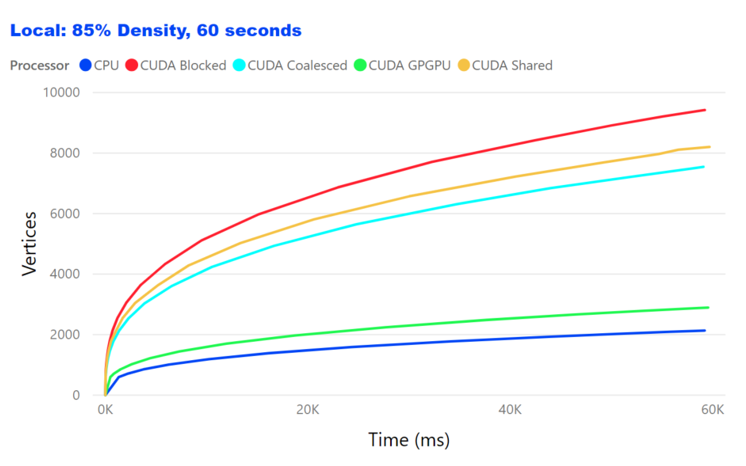

*Figure 5*. Floyd-Warshall Algorithm running on Local PC with 85% graph
density

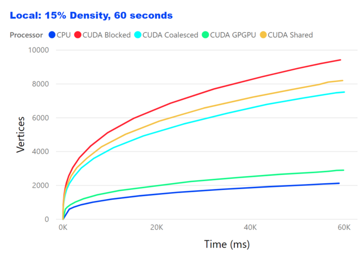

*Figure 6*. Floyd-Warshall Algorithm running on Local PC with 15% graph
density

Testing on Azure
----------------

Running Floyd-Warshall Algorithm on Azure VM has rendered similar
results to what was shown in a local environment with a few noteworthily
highlights. The results are shown in Figure 7 and 8.

First, while using CUDA Shared memory optimization in a local
environment has produced second best performance results, on Azure,
however, using CUDA Shared memory optimization was almost 50% slower
than using CUDA Blocked memory optimization and still about 25% slower
than CUDA Coalesced memory optimization.

This behavior of the CUDA Shared memory optimization can be explained by
the fact that the program was written to take the most advantage of the
CUDA characteristics for the given GPU Card in a local environment with
the CUDA capabilities much higher of that is given with the Azure NC6
Standard configuration, as explained in the section 5.2 of this
document.

Second, the overall performance of running this test using CPU and GPU
(GPGPU) linear optimizations on Azure was similar to the results we
obtained when testing on a local environment. The difference starts
escalating when using the more advanced CUDA optimization techniques,
where the local NVIDIA GeForce 1080 Ti video card clearly outperformed
the NVIDIA Tesla K80 that was used on Azure VM.

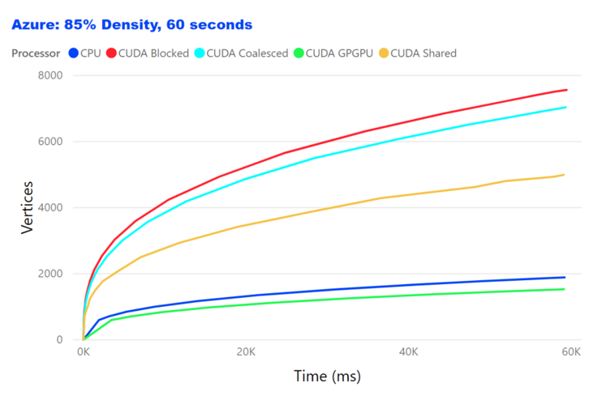

*Figure 7*. Floyd-Warshall Algorithm running on Azure VM with 85% graph
density

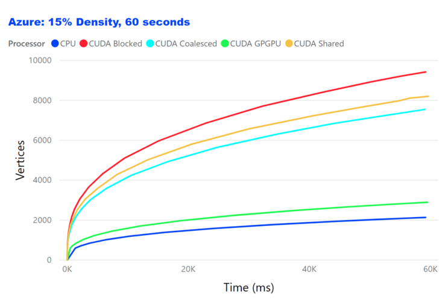
*Figure 8*. Floyd-Warshall Algorithm running on Azure VM with 15% graph
density

Effects of Graph Density
------------------------

The performance of both local and Azure systems has been tested on two
near polar-opposite values of graph density: 15% and 85% of density.
When testing in a local environment, we could not see much difference in
the number of computed vertices within the 60 seconds of testing time.
Since the Floyd-Warshall algorithm has the time complexity of
$\Theta\ (n3)$, we were expecting to see the number of vertices
increased since the number of calculations required was significantly
reduced thanks to the total number of edges in a generated graph was
reduced from 85% to 15%. However, the time spent in remembering the
indices of the rows and columns, whose elements will not change, is
$\Theta\ (n)$. Thus, the time saved by doing less number of calculations
was not enough to compensate for the time lost in the execution of the
step required to remember indices or, in other words, wasn't significant
comparing to the speed the GPU threads computed the algorithm vertices.

Interestingly enough, the difference in the graph density can be seen
quite clearly when comparing the results obtained from running on Azure.
With less calculation required for computing more sparse graphs (15%
density), the CUDA Shared Memory optimization performed better than the
CUDA Coalesced Memory optimization, while only dragging 25% off the pace
of the CUDA Coalesced Memory optimization when testing with 85% density.

Also, the CPU Linear optimization has outperformed the GPU GPGPU
Optimization in the similar conditions: it was better with dense graphs,
and poorer with sparse graphs.

Comparing Local vs Azure
------------------------

To compare the results obtained from running the Floyd-Warshall
algorithm in both local and Azure environment, we analyzed and compare
in two categories: CPU, and GPU Best memory optimization, which we
concluded was without doubts the CUDA Blocked Memory optimization. The
results of this comparison are shown in Figure 9 and 10 respectively.

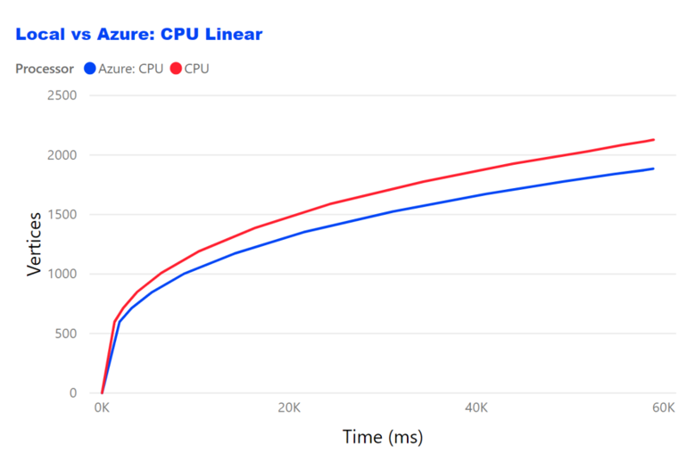
*Figure 9*. Local CPU vs Azure CPU Comparison

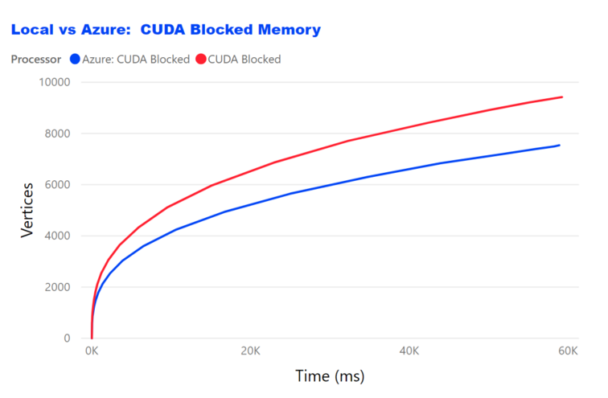
*Figure 10*. Local GPU vs Azure GPU (Blocked Memory Optimization)
Comparison

In both categories, the winner was clearly the local environment. It
outperformed its Azure counterpart on average of 20%. We have already
explained the fact that the GPU card used in a local environment has
better CUDA capabilities than one used in the tested Azure VM, and the
power of the 16 core CPU used on a local PC is greater than the one
provided by Azure infrastructure. That's said, the test was specifically
focused to compare Local environment vs Azure. For that reason, the SKU
used to create an Azure VM wasn't chosen to the best possible
specification. The main reason we have provided here the comparison of
running Floyd-Warshall algorithm in both local and Azure environment was
to test and validate that with the appropriate CUDA memory optimization
technique, it is possible to achieve the near real-time performance
characteristics when applying these techniques to lower number of graph
vertices, as we expected it would be the case in the real world scenario
of the airport baggage handling.

Target Time Performance
-----------------------

As we specified in the Abstract section of this study and again, in the
problem statement, the one of the important questions we wanted to get
answer for was to see how many graph vertices we could compute in the
target time of 2 seconds. The Figure 11 plots the results of running the
Floyd-Warshall algorithm in a local environment with 2 seconds time
constraint.

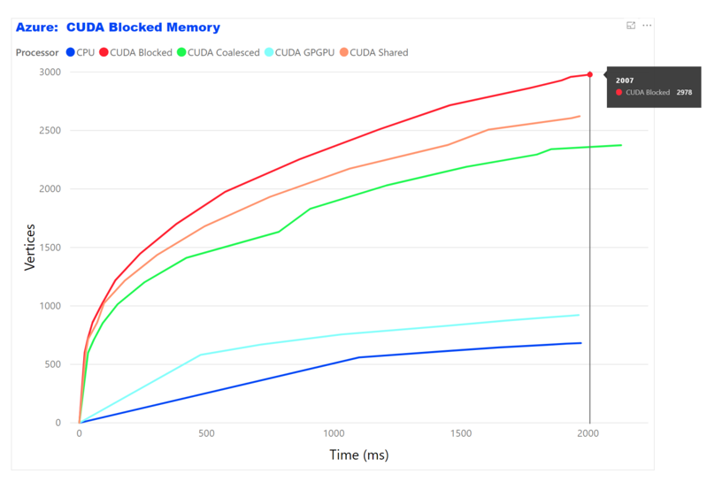
*Figure 11*. Running the Floyd-Warshall algorithm in a local environment
under 2 seconds constraint

As seen from the results, the CUDA Blocked memory optimization passes
the 2000 vertices mark in just 2 seconds, while reaching the 500
vertices in less than 12 milliseconds! That's the true real-time
performance.

Another interesting question was to see how many vertices we could
generally compute if given no time constraints. Obviously, in this case
the physical memory constraints will be to count for. So, we ran the
program on Azure VM using only CUDA Blocked Memory optimization. The
results are shown in the Figure 12.

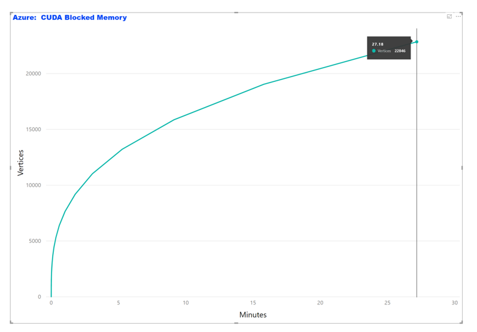
*Figure 12*. Running the Floyd-Warshall algorithm using CUDA Blocked
Memory Optimization until the program crashed

The program crashed after 27 minutes of running. The last time the
output metrics were written into an output file we were able to see that
it computed 22,846 vertices. It's 521 million of elements graph with
close to 12 trillion calculations! To keep this whole graph in memory
would require at least 2 TB of GPU global memory!

CONCLUSION
==========

In this paper, we have done a comparative study on various CPU and GPU
memory optimization techniques when computing all-pairs shortest path
(APSP) Floyd-Warshall algorithm. We have also theorized that we can
achieve a near real-time computer supported decision system that can
continuously suggest the most optimal way to complete "transfer" tasks
and thus play a significant role in reducing the Misconnected Bag Rate
(MBR). Our target goal was to produce at least 220 vertices ($\approx$
of gates in a large sized airport) under 2 seconds time constraint.

Our experiments comparing the performance of various memory optimization
techniques when applied to the Floyd-Warshall algorithm clearly indicate
that although running on a local environment outperformed the results
obtained from an Azure VM, both system configurations have exceeded the
goals of this study, especially for sparse graphs. Therefore, in the
real-world scenario of baggage handling, using the Floyd-Warshall
algorithm with the most optimal CUDA Blocked Memory optimization could
have a significant role in reducing the MBR, the most important metrics
of airport baggage handling operations.

ACKNOWLEDGEMENTS
================

The author would like to thank the reviewers for giving valuable
comments and suggestions, and especially, Max Zilberman, for his ideas
and feedback to revise some parts of the manuscript in the present form.

REFERENCES
==========

Abdelghany A, A. K. (2016). Scheduling baggage-handling facilities in
congested airports. *Journal of Air Transport Management*, 76 - 81.Ben
Lund, J. W. (2010). *A Multi-Stage CUDA Kernel for Floyd-Warshall.*
Cincinnati, OH: University of Cincinnati.Dina Hafilah, A. R.-R.
(December 2017). Modeling and Simulation of Baggage Handling System in A
Large Airport. *The 18th Asia Pacific Industrial Engineering and
Management System Conference (APIEMS 2017).* Yogyakarta,
Indonesia.Floyd, R. W. (1962, June). Algorithm 97: Shortest Path.
*Communications of the ACM.*, p. 345.Gayathri Venkataraman, S. S.
(2003). A blocked all-pairs shortest-paths algorithm. *J. Exp.
Algorithmics*, 8:2.2.Hwu, D. K.-M. (2010). *Programming Massively
Parallel Processors: A Hands-on Approach.* Jr, G. J. (2008). All-pairs
shortest-paths for large graphs on the GPU. *Proceedings of the 23rd ACM
SIGGRAPH/EUROGRAPHICS symposium on Graphics hardware* (pp. 47-55).
Sarajevo, Bosnia and Herzegovina: Eurographics Association.Narayanan, P.
H. (2007). Accelerating large graph algorithms on the GPU using CUDA.
*Lecture Notes in Computer Science*, 197.NVIDIA Corporation. (2019,
February). *NVIDIA CUDA Programming Guide*. Retrieved from CUDA C
Programming Guide:
https://docs.nvidia.com/cuda/pdf/CUDA\_C\_Programming\_Guide.pdf

[$^1$]: For the full code excerpt see [Floyd.cu](src/cpp/cuda/src/Floyd.cu) source code

[$^2$]: At the time of writing this paper, the latest GPU card from NVIDIA
    was GeForce RTX 2080 Ti
